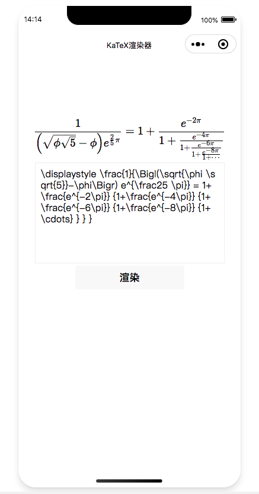

# katex-weapp

基于 KaTeX 构建的小程序原生 LaTeX 渲染组件（不依赖服务端渲染）

## 实现原理

基于 katex 库，解析 latex 公式生成虚拟 dom 树对象，将 dom 对象翻译成小程序的 rich-text 支持的 nodes 由小程序渲染

> 依赖微信小程序的 RichText 组件渲染，请注意小程序基础库 1.4.0 开始支持，低版本需做兼容处理。  
> 由于 katex 库过大，引入`eval5`模块对象 katex 模块进行在线加载，从而减小小程序的包体大小

## Demo

### 在线 Demo


### taro 版本 Demo

https://github.com/rojer95/katex-mini-taro-demo

## 运行 demo

1. clone 项目

```bash
git clone https://github.com/rojer95/katex-weapp.git
```

2. 在 Demo 项目安装依赖

```bash
cd ./katex-weapp/demo
npm install
```

3. 用小程序开发者工具打开 demo 目录，在小程序开发者工具中执行“工具 - 构建 npm”

## 在原生小程序项目中直接使用

1. 在小程序中安装依赖

```bash
npm install @rojer/katex-mini
```

2. 在小程序开发者工具中 - 工具 - 构建 npm，执行后会看到生成的`miniprogram_npm`目录

3. 在 `app.wxss` 加载 katex 的内置 css 样式

```less
@import "./miniprogram_npm/@rojer/katex-mini/index.wxss";
```

4. 在 app.js 的 onLaunch 中加载 katex

```js
// app.js
import { loadKatex } from "@rojer/katex-mini";
App({
  onLaunch() {
    // 通过动态方式加载katex代码，节省小程序包体大小
    wx.request({
      url: "https://lib.baomitu.com/KaTeX/latest/katex.min.js",
      success: ({ data: code }) => {
        loadKatex(code);
        wx.katex = true;
      },
    });
  },
});
```

5. 在小程序中解析 latex

```js
// index.js
import parse from "@rojer/katex-mini";

Page({
  data: {
    nodes: [],
    latex:
      "\\displaystyle \\frac{1}{\\Bigl(\\sqrt{\\phi \\sqrt{5}}-\\phi\\Bigr) e^{\\frac25 \\pi}} = 1+\\frac{e^{-2\\pi}} {1+\\frac{e^{-4\\pi}} {1+\\frac{e^{-6\\pi}} {1+\\frac{e^{-8\\pi}} {1+\\cdots} } } }",
  },

  onInput: function (e) {
    this.setData({
      latex: e.detail.value,
    });
  },

  renderLatex: function () {
    this.setData({
      nodes: parse(this.data.latex),
    });
  },
});
```

6. 在页面中展示

```html
<!--index.wxml-->
<view class="container">
  <rich-text nodes="{{nodes}}"></rich-text>
  <textarea value="{{latex}}" bindinput="onInput" maxlength="1400"></textarea>
  <button bindtap="renderLatex">渲染</button>
</view>
```

## 效果预览图


